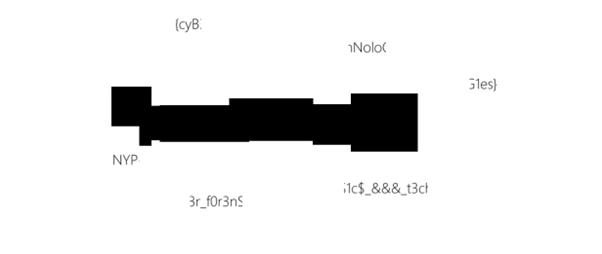

# Bruh

**Challenge Category: Forensics** <br />
**Challenge Points: 500**

## Challenge Description

Wowzers, I can't open the file? Plz Help! Regards

[(Download something_is_wrong.webp)](../.files/forensics_bruh.webp)

## Analysis

Trying to open the file would result in an error, no matter the file viewer you choose. So, let's do some analysis of what this file could be.

### `file` tool

Running the `file` command would not give any meaningful information other than an unknown file data response.

```sh
$ file something_is_wrong.webp
```

```
something_is_wrong.webp: data
```

### `binwalk` tool

Running the `binwalk` command would give an odd hint that the file contains `Zlib compressed data`. This usually hints an inaccurate detection.

```sh
$ binwalk something_is_wrong.webp
```

```
DECIMAL       HEXADECIMAL     DESCRIPTION
--------------------------------------------------------------------------------
91            0x5B            Zlib compressed data, compressed
```

### `exiftool` tool

Running the `exiftool` command would result in a `File format error` as well.

```sh
$ exiftool something_is_wrong.webp
```

```diff
  ExifTool Version Number         : 12.65
+ File Name                       : something_is_wrong.webp
  Directory                       : .
  File Size                       : 21 kB
  File Modification Date/Time     : 2023:12:22 11:27:58-05:00
  File Access Date/Time           : 2023:12:24 03:58:34-05:00
  File Inode Change Date/Time     : 2023:12:24 03:58:26-05:00
  File Permissions                : -rwxrw-rw-
- Error                           : File format error
```

### `hexdump` / `xxd` tool

Our analysis using usual tools above has gotten us nowhere. We will now have to look into the raw data of the file using either `hexdump` or `xxd`.

```sh
$ xxd something_is_wrong.webp | head -n 3
```

```diff
- 00000000: 8950 4e00 0000 0000 0000 000d 4948 4452  .PN.........IHDR
  00000010: 0000 04d0 0000 0209 0806 0000 0064 d3c0  .............d..
  00000020: 3800 0000 0173 5247 4200 aece 1ce9 0000  8....sRGB.......
```

You will notice that the magic number of this file resembles a `PNG` file type.

For reference:

```diff
+ PNG Magic Numbers: 89 50 4E 47 0D 0A 1A 0A
- Our Magic Numbers: 89 50 4E 00 00 00 00 00
```

Other clues of what the file could possibly include the strings `IHDR` and `sRGB`.

## Solution

We know that the file type is possibly a `PNG` image instead of `Webp` from the magic numbers. We will have to edit the header and file extension to view the image properly.

```sh
$ xxd -r -p -o 0 <(echo 89504E470D0A1A0A) something_is_wrong.webp
```

```sh
$ xxd something_is_wrong.webp | head -n 3
```

```diff
+ 00000000: 8950 4e47 0d0a 1a0a 0000 000d 4948 4452  .PNG........IHDR
  00000010: 0000 04d0 0000 0209 0806 0000 0064 d3c0  .............d..
  00000020: 3800 0000 0173 5247 4200 aece 1ce9 0000  8....sRGB.......
```

We've fixed the file header. Now, we need to change the file extension as well to open the file properly.

```sh
$ mv something_is_wrong.webp something_is_wrong.png
```

```sh
$ open something_is_wrong.png
```



Finally, piece all of the image chunks together.

```
NYP{cyB3r_f0r3nS1c$_&&&_t3chNoloG1es}
```

## After Competition Note

Although I managed to extract the flag from the challenge file, I did not manage to submit the flag on time due to an error in my flag. Nevertheless, it was a good challenge and reminded me to always dig deeper.
