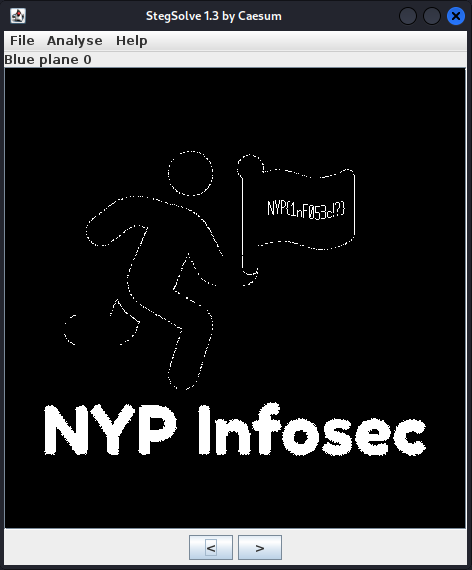

# Running Man

**Challenge Category: Forensics** <br />
**Challenge Points: 500**

## Challenge Description

Found an image in the data files somewhere. A funny looking man running while holding a flag. It doesn't seem to be used anywhere in the system though? Might be just a useless file.

[(Download running-man.png)](../.files/forensics_running_man.png)

## Solution

Running commands such as `file`, `binwalk`, `exiftool`, `steghide`, `zsteg` will not reveal the flag as it is really an image file. However, this is a steganography challenge.

```sh
java -jar stegsolve.jar
```

Open the file in Stegsolve and cycle through the different modes until you find the flag.



```
NYP{1nF053c!?}
```
