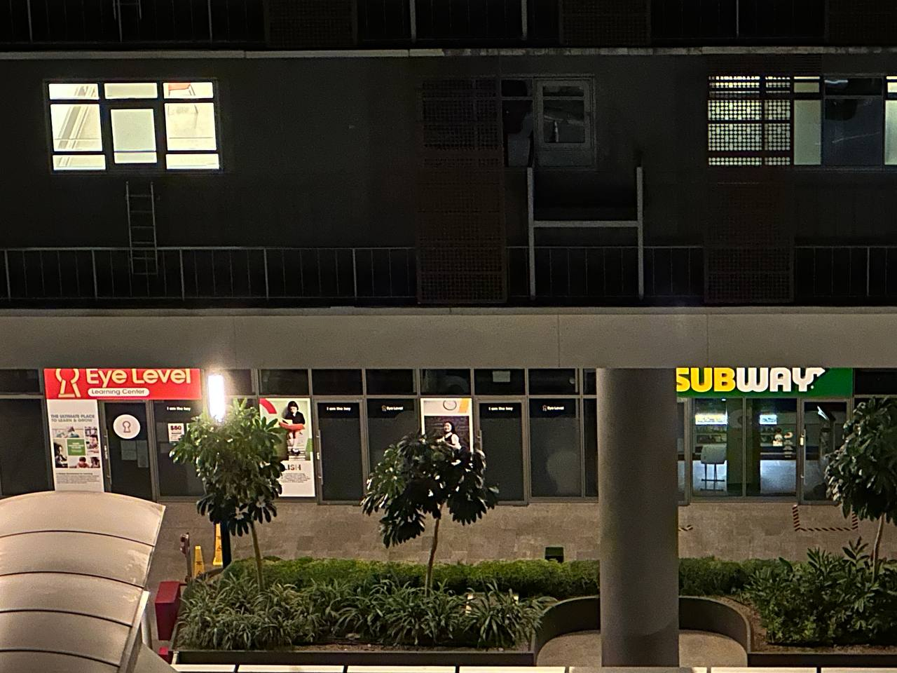

# Find me

**Challenge Category: OSINT** <br />
**Challenge Points: 500**

## Challenge Description

Locate where I am at the flag would be the postal code of the location found NYP{postal_code}



## Solution

1. There are 2 outlets shown in the picture, **Eye Level Learning Centre** and **Subway**.
2. Since Subway has many outlets located all over Singapore, it would not be wise to use Subway as a landmark.
3. Search "Eye Level Learning Centre Locations" on Google and list the locations.
4. Every outlet of **Eye Level Learning Centre** has a different appearance on the outside. But one outlet will catch the eye.


5. Since it is an exact match with the challenge image, copy the postal code from Google maps and build the flag.

```
NYP{544886}
```
