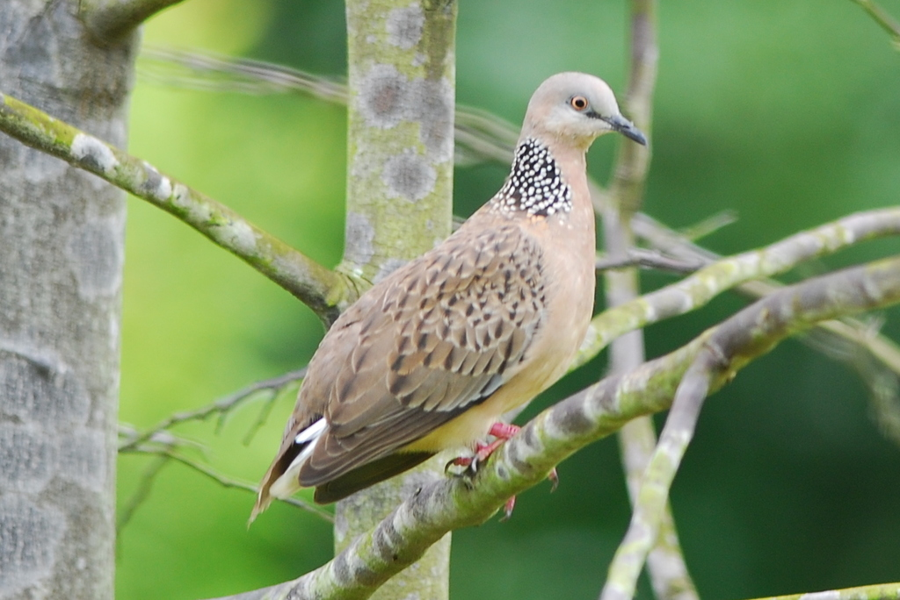

# What am I

**Challenge Category: OSINT** <br />
**Challenge Points: 500**

## Challenge Description

Tell me what I am (be specific) Flag format is NYP{SPECIES_OF_BIRD} (in all caps)



## Solution

1. Upload the image to Google Images for reverse searching.
2. Google immediately identifies the scientific name of the species as **Streptopelia Chinensis**.
3. Build the flag to comply with challenge description

```sh
$ echo "NYP{Streptopelia Chinensis}" | tr a-z A-Z | tr -s ' ' '_'
```

```
NYP{STREPTOPELIA_CHINENSIS}
```
